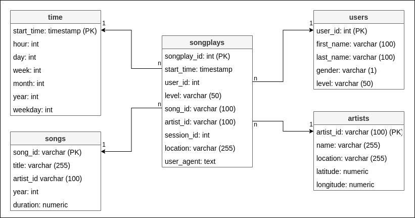
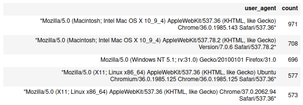
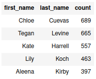

# Song Play Analysis

## Summary
* [Project](#Project)
* [Database schema](#Database-Schema)
* [File organization](#File-Organization)
* [How to use](#How-to-Use)
* [Example queries](#Example-Queries)

## Project

A startup company called Sparkify wants to analyze the data they have been collecting on songs and user activity on their new music streaming app. 

In this project, we'll be creating a database schema and ETL pipeline in order to help them query their data and optimize the analysis.

## Database Schema

A **star schema** has been used to structure the data in the database. This type of schema provides simpler queries and results in improved performance for aggregation operations.

In the center of the schema is defined the fact table called **songplays**. It contains the foreign keys to the dimension tables called users, time, artists and songs. 

In each dimension table is stored more specific details about a particular record in the fact table.




## File Organization
    . 
    ├── images                  # images used in the documentation                
    ├── data                
    |   ├── log_data            # folder that contains the log files generated by an event simulator
    |   ├── song_data           # folder that contains the data from the Million Song Dataset. Each file contains metadata about a song and the artist of that song
    ├── sql_queries.py          # script that contains all the sql queries
    ├── create_tables.py        # script that drops and creates the tables of the database
    ├── etl.py                  # script that reads and processes files from song_data and log_data and loads them into the database
    ├── etl.ipynb               # notebook that reads and processes a single file from song_data and log_data and loads the data into the tables
    ├── test.ipynb              # notebook that displays the first few rows of each table 
    └── README.md               

## How to Use

1. Execute the `create_tables.py` to construct the sparkifydb database and tables displayed in the schema.

2. Run `etl.py` to connect to sparkifydb database, process the files from the song_data and log_data datasets and insert the raw data into its corresponding table.   

After executing the steps above, the data can be used for ad-hoc queries and analytic purposes.

## Example Queries

Most used user agent

``` SQL
SELECT user_agent, count(user_agent) 
FROM  songplays 
GROUP BY user_agent 
ORDER BY count 
DESC 
LIMIT 5
```



Most active users 

``` SQL
SELECT first_name, last_name, count 
FROM users 
JOIN (
    SELECT songplays.user_id, count(songplays.user_id) 
    FROM songplays 
    GROUP BY user_id
    ) AS songplays 
ON users.user_id = songplays.user_id 
ORDER BY count 
DESC 
LIMIT 5
```

